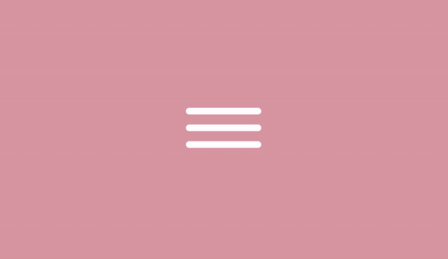
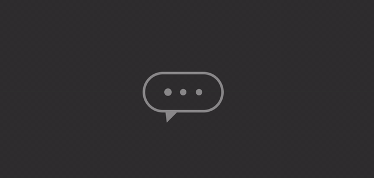

# CSS 

* [Dia 01 - Ícone de mídia social em camadas](#day01)
* [Dia 02 - Loading animado](#day02)
* [Dia 03 - Efeito banner com mudança de cor do texto](#day03)
* [Dia 04 - Botão com borda animada](#day04)
* [Dia 05 - Botão com efeito pulse](#day05)
* [Dia 06 - Texto com efeito líquido](#day06)
* [Dia 07 - Ícone para menu hamburguer](#day07)
* [Dia 08 - Relógio utilizando neomorfismo](#day08)
* [Dia 09 - Menu bubble](#day09)
* [Dia 10 - Loading animado](#day10)
* [Dia 11 - Botão On/Off](#day11)
* [Dia 12 - Polaroid](#day12)
* [Dia 13 - Linear-gradient animado](#day13)
* [Dia 14 - Indicador de chat](#day14)
* [Dia 14 - Dia ensolarado](#day15)

##  Desafio dia 01 - Ícones de redes sociais em camadas 

##  Desafio dia 02 - Loading animado 

##  Desafio dia 03 - Efeito banner com mudança de cor do texto 

##  Desafio dia 04 - Botão com borda animada 

##  Desafio dia 05 - Botão com efeito pulse 

##  Desafio dia 06 - Texto com efeito líquido 

##  Desafio dia 07 - Ícone para menu hamburguer 

##  Desafio dia 08 - Relógio utilizando neomorfismo 

##  Desafio dia 09 - Menu bubble 

##  Desafio dia 10 - Loading animado 

##  Desafio dia 11 - Botão On/Off 

##  Desafio dia 12 - Polaroid 

##  Desafio dia 13 - Linear-gradient animado 

##  Desafio dia 14 - Indicador de chat (digitando...) 

##  Desafio dia 15 - Dia Ensolarado 

